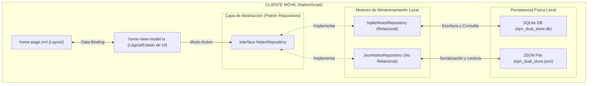

# FIS - PROGRAMACIÓN DE APLICACIONES MÓVILES
## Examen Práctico: Persistencia Híbrida Dual (SQL vs NoSQL)
### Arquitectura desacoplada con conmutación en caliente para bases de datos locales

Este repositorio contiene la solución del Examen Práctico de la cátedra de Programación Móvil de la Facultad de Ingeniería de Sistemas (FIS) de la Escuela Politécnica Nacional (EPN).

---

## 🚀 Características del Examen

1. **Patrón Repositorio (Desacoplamiento Estricto)**:
   - Capa de abstracción limpia mediante la interfaz `NotesRepository` que desacopla la UI de la base de datos física.
   - Dos implementaciones aisladas e independientes del almacén:
     - **SQL Relacional (`sqlite-repository.ts`)**: Basado en sentencias SQL con `nativescript-sqlite`.
     - **NoSQL Documental (`json-repository.ts`)**: Basado en persistencia sin esquema serializando a archivos JSON en el directorio de documentos del dispositivo.

2. **Conmutación en Caliente (Runtime Toggle)**:
   - Un interruptor (Switch) interactivo en la pantalla que alterna el motor de datos activo en tiempo de ejecución de manera instantánea, actualizando la reactividad de la lista sin reiniciar la aplicación.

3. **Pruebas Unitarias Automatizadas**:
   - Una suite completa de pruebas locales (`tests/run-tests.ts`) ejecutada directamente con `ts-node` sobre un entorno CommonJS adaptado (`tsconfig.test.json`).
   - Valida la consistencia de escritura/lectura y el aislamiento total de datos entre SQL y NoSQL.

4. **Diseño Moderno Claro en Tonos Pastel**:
   - Interfaz refinada basada en el mockup de referencia con tonos lavanda, lila y crema.
   - Listado de notas diseñado con el estilo visual de historial de búsquedas de alta gama, incluyendo íconos circulares y botones redondos para acciones de edición y eliminación.

---

## 🛠️ Arquitectura del Sistema

El siguiente diagrama en formato Mermaid representa el diseño de persistencia híbrida:



---

## 🏁 Guía de Ejecución Rápida

### 1. Instalar Dependencias
Navega a la carpeta del examen/cliente e instala los paquetes:
```bash
cd examen/client
npm install
```

### 2. Ejecutar Pruebas Automatizadas
Verifica la consistencia e integridad de las bases de datos de forma local:
```bash
npm test
```
**Resultado esperado:**
```bash
[PASS] write-and-read
[PASS] switching-isolation
```

### 3. Ejecutar TypeScript Typecheck
Comprueba que el tipado estático no posea errores:
```bash
npx tsc --noEmit
```

### 4. Lanzar la Aplicación en el Celular/Emulador
Despliega el código compilado a tu dispositivo Android conectado:
```bash
ns run android
```
El motor de NativeScript creará las tablas SQLite y los archivos JSON en los directorios aislados de la aplicación móvil de manera automática.
