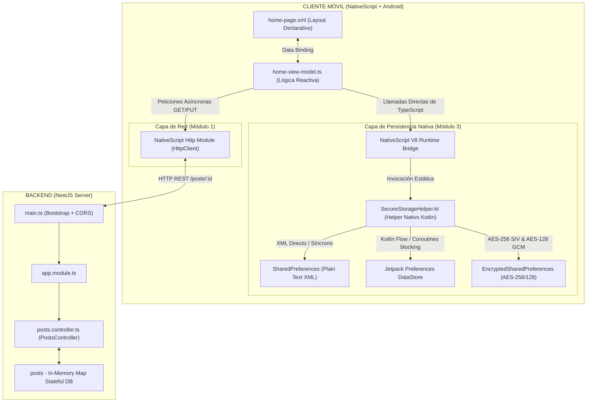

# FIS - Programación de Aplicaciones Móviles
## Proyecto: Red y Seguridad
### Conectividad asíncrona HTTP REST y persistencia segura de secretos en Android nativo con NativeScript

Este repositorio contiene el código del cliente móvil del proyecto de Red y Seguridad desarrollado para la Facultad de Ingeniería de Sistemas (FIS) de la Escuela Politécnica Nacional (EPN).

---

## 🚀 Características del Proyecto

1. **Conectividad REST**:
   - Peticiones asíncronas HTTP `GET`/`PUT` a un servidor backend local desarrollado en **NestJS**.
   - Control de estados de carga (`loading states`) y notificaciones interactivas para prevenir problemas de concurrencia.
   - Soporte dinámico para túneles de **ngrok** para depuración transparente en dispositivos reales.

2. **Almacenamiento Seguro Nativo**:
   - Integración nativa de Android mediante un helper en Kotlin (`SecureStorageHelper.kt`).
   - Comparación de tres mecanismos de persistencia:
     1. **SharedPreferences**: Almacenamiento plano en XML (texto plano).
     2. **Jetpack Preferences DataStore**: Reactivo y asíncrono sobre el hilo de UI.
     3. **EncryptedSharedPreferences**: Cifrado militar automático a disco mediante `AES-256 SIV` y `AES-128 GCM` a través del Android Keystore.

3. **Interfaz Neo-Brutalista Oscura**:
   - Diseño moderno con fondo obsidiana oscuro (`#0A0A0C`).
   - Tarjetas de alto contraste en tonos coral, violeta, amarillo y verde menta.
   - Ocultamiento de la barra de acciones nativa en favor de un toolbar superior personalizado y minimalista.

---

## 🛠️ Arquitectura del Sistema

El siguiente diagrama ilustra el flujo de comunicación y el puente nativo entre JavaScript (V8 Bridge) y las APIs nativas de Android:



---

## 🏁 Guía de Ejecución Rápida

### 1. Iniciar Servidor NestJS
Navegar al directorio del backend, instalar dependencias y ejecutar:
```bash
cd backend
npm install
npm run start:dev
```
El servidor backend se ejecutará localmente en `http://localhost:3000`.

### 2. Crear Túnel Seguro (ngrok)
En otra terminal, expón el puerto 3000 a internet usando ngrok:
```bash
ngrok http 3000
```
Obtén la URL pública HTTPS provista por ngrok (ej. `https://xxxx.ngrok-free.app`) y actualízala en el atributo `_backendUrl` de [home-view-model.ts](app/home/home-view-model.ts).

### 3. Ejecutar Aplicación NativeScript
Asegúrate de tener un celular conectado vía USB o un emulador activo. Luego navega al directorio del cliente y ejecuta:
```bash
cd client
npm install
ns run android
```
El CLI de NativeScript compilará automáticamente el código Kotlin nativo (`SecureStorageHelper.kt`) y las dependencias Gradle de Jetpack, desplegando la aplicación en tu celular.
